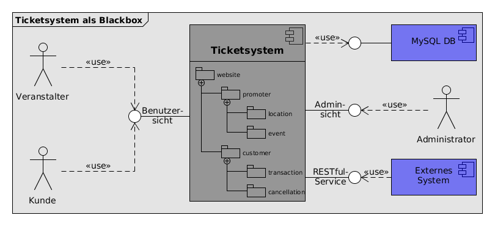
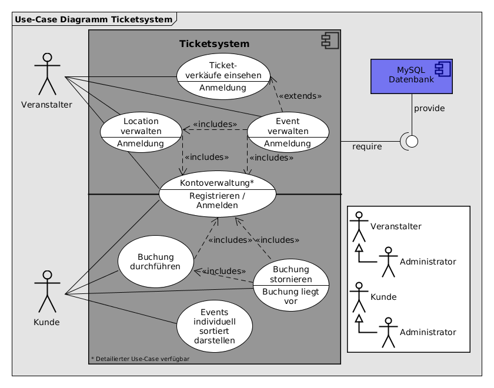
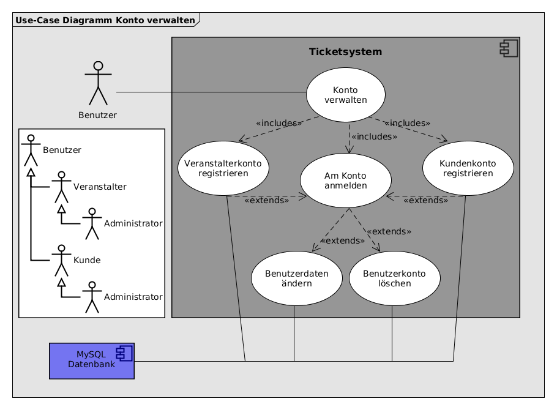
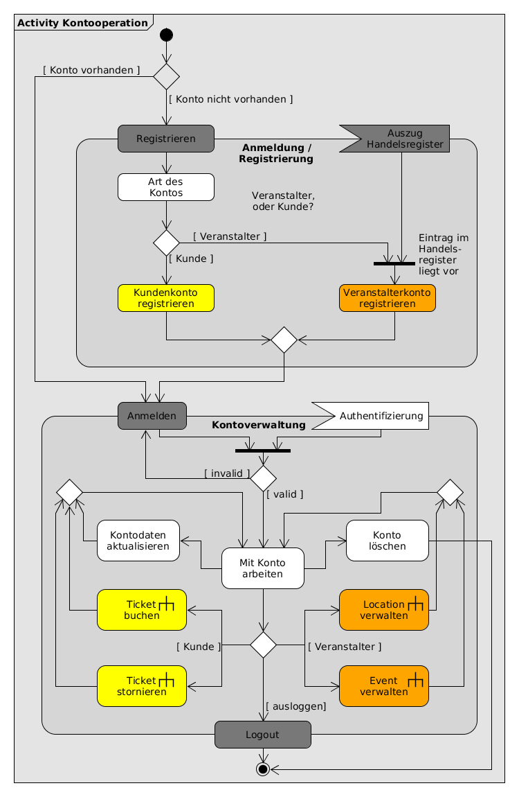
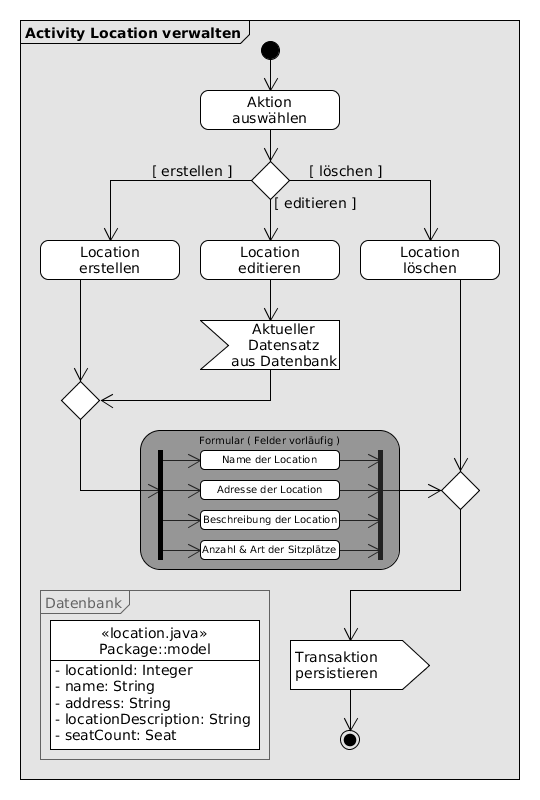
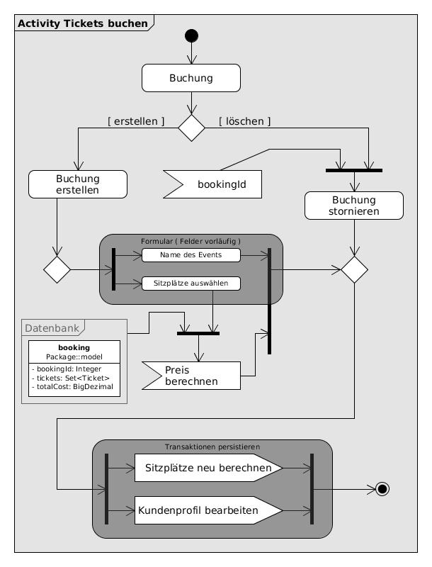
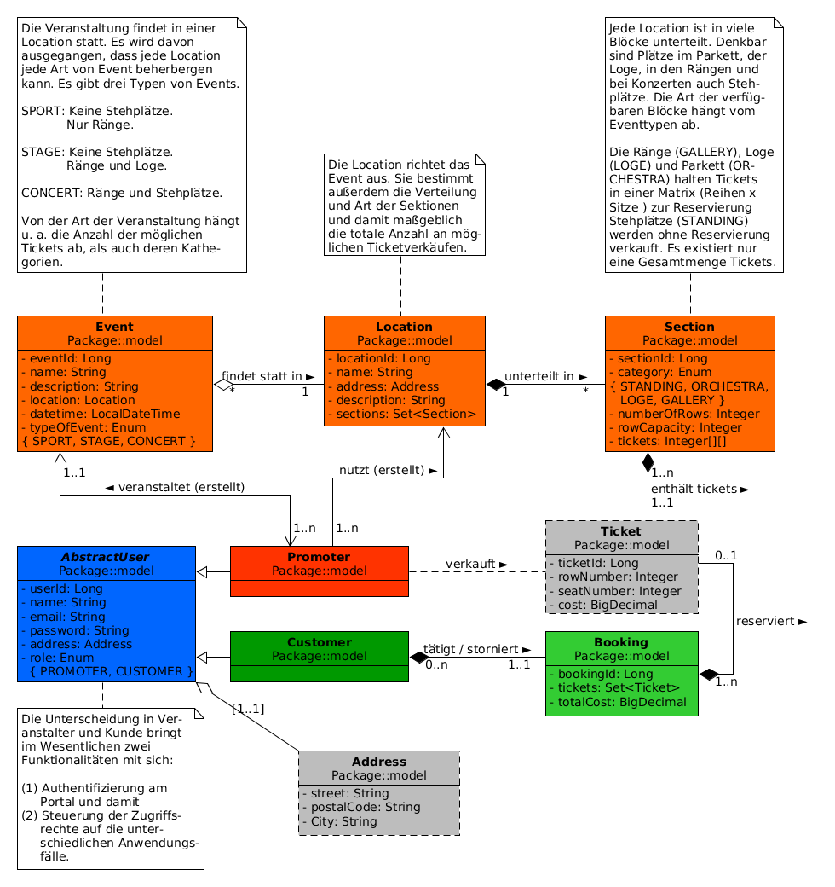

# Onlineverkaufsplattform für Tickets #

Das Ticketsystem soll eine Verkaufsplattform für Eintrittskarten zu unterschiedlichen Veranstaltungen sein.
Benutzer dieses Ticketsystems sind *Veranstalter* und *Kunden*.
Die Veranstalter richten die Orte und Veranstaltungen ein. Die Kunden können über das Portal Tickets kaufen.
Weitere Akteure sind der *Administrator* und potentielle *externe Systeme*.

Es existieren *Veranstaltungsorte* (locations), *Veranstaltungen* (events) und *Veranstaltungsserien* (event_series).

#### Veranstalter kann folgende Handlungen durchführen: ####

* sich als Veranstalter registrieren.
* Bilder für Veranstaltungen und Orte hochladen.
* Veranstaltungsort / Veranstaltung / Veranstaltungsserie registrieren.
* laufende Verkäufe einsehen.

#### Kunde kann folgende Handlungen durchführen: ####

* sich als Kunde registieren.
* Veranstaltungen nach verschiedenen Kriterien sortieren.
* Tickets buchen. Auswahl mehrer Tickets möglich, aber nicht mehrerer Veranstaltungen pro Buchung.
* Buchung stornieren (BuchungsID) --> Tickets fließen wieder in Verkauf.

#### Ein Veranstaltungsort (location) besteht aus folgenden Informationselementen: ####

 * Name
 * Bild
 * textuelle Beschreibung
 * Ticketkategorie

	* Anzahl zur Verfügung stehender Tickets unterteilt in ggf.
          Anzahl Reihen und Anzahl Plätze pro Reihe.
	* Raum, Klasse (Loge, VIP), andere Zusätze... 

#### Eine Veranstaltung (event) besteht aus folgenden Informationselementen: ####

 * Name
 * Bild
 * textuelle Beschreibung
 * Art der Veranstaltung
 * Veranstaltungsort

#### Administrator darf folgende Handlungen durchführen: ####

 * Veranstaltungen editieren und/oder löschen.
 * Kundenkonten editieren und/oder löschen.
 * Veranstalterkonten editieren und/oder löschen.

#### Externe Systeme ####

 * können eine Liste der aktuellen Veranstaltungen über einen RESTful Service abrufen (JSON)

# Der Systementwurf #
Die folgenden Abschnitte zeigen in steigenden Detailierungsgraden die unterschiedlichen Entwurfsschritte des Systems, welches durch dieses Projekt implementiert wird.

## Das System als Blackbox ##

Die primären Benutzer der Onlineticketplattform sind die Veranstalter und ihre Kunden. Veranstalter definieren die Locations, an denen die Events stattfinden. Die Location bestimmt außerdem die zur Verfügung stehenden Tickets. Interessenten können erst einmal ohne Verbindlichkeiten über das Portal durch die Events surfen. Eine Bestellung kann jedoch nur über einen gesonderten Kundenaccount getätigt werden, sofern ein Veranstalter seinerseits über einen gesonderten Veranstalteraccount eine Örtlichkeit und die entsprechende Veranstaltung eingerichtet hat.

## Anwendungsfälle ##

Obige Abbildung zeigt grob die möglichen use cases, die von den in der Systembeschreibung genannten Nutzern über die verschiedenen Schnittstellen durchgeführt werden können. Diesen Anwendungsfällen geben aber nur einen ersten Ausblick auf die noch zu implementierende Geschäftslogik. Im Folgenden werden die abgegrenzten use cases in Aktivitätendiagrammen genauer ausgeführt.

### Use case Kontoverwaltung ###

Eine Grundfunktionalität der Ticketplattform ist die Anmeldung am Portal. Damit dies möglich ist muss der Nutzer sich ein Konto erstellen. Während des Registrierungsprozess entscheidet der Benutzer, ob ein Veranstalterkonto, oder ein Kundenkonto erstellen möchte. Ersters wird benötigt, um Locations zu erstellen und Events auszurichten. Zu diesen Veranstaltungen können nun geneigte Benutzer über deren Kundenkonto Eintrittskarten zur gewählten Veranstaltung.
Hat man sich an seinem Konto angemeldet können die im Konto hinterlegten Benutzerdaten geändert, oder das Konto selbst wieder gelöscht werden.

#### Veranstalter / Promoter Konto ####

##### Kontoverwaltung #####

Der Prozess der Kontoverwaltung spielt sich schematisch dargestelt wie folgt ab:
Sofern noch kein entsprechendes Konto existiert, entscheidet sich der Benutzer eingangs für die Art der Registrierung.
Möchte er ein Veranstalterkonto eröffnen, so muss zusätzlich noch ein Geschaftsnachweis erbracht werden.
Dieser ist in Form einer Kopie des Handelsregistereintrages, oder Gewerbescheins denkbar,
wird im Zuge dieser Projektaufgabe aber via Checkbox implementiert. Ist ein Konto bereits vorhanden, kann direkt mit der
Anmeldung fortgefahren werden. Im Anschluss sind je nach Art des Kontos unterschiedliche Handlungen verfügbar.

Veranstalter dürfen Locations und Events verwalten, während Kunden Buchungen durchführen und ggf. wieder stornieren können.
Jeder dieser vier Vorgänge wird nachfolgend seperat behandelt, läuft im Wesentlichen aber ähnlich obiger Abbildung ab:
Ziel soll es sein, dass jede Handlung authentifizierungspflichtig ist, also beim Aufruf geprüft wird (spring.security),
ob der Benutzer das entsprechend Konto für die gewünschte Handlung führt. Wurde durch die Website bestätigt,
darft die Aktion durchgeführt werden. Weiter noch, wird die Aktion überhaupt erst angezeigt, nachdem sich der Benutzer vor dem
Portal authentifiziert hat.

##### Location verwalten #####

Location und Event verwalten laufen prinzipiell ähnlich, weshalb hier nur auf eines exemplarisch eingegangen werden soll. Der Veranstalter hat in beiden Fällen die Entscheidungsmöglichkeiten zwischen dem Anlegen, dem Editieren und dem Löschen eines Eintrages.
Prinzipiell wird eine Loction benötigt, um eine Veranstaltung auszurichten. Deshalb sollte dieser use case zeitlich davor durchgeführt werden, ein Querverweis von Veranstaltung verwalten auf Location verwalten ist aber denkbar.
Möchte ein Promoter eine Veranstaltung erstellen, so muss in einem Formular die notwendigen Details eintragen. Die Funktion zum hochladen eines Bildes wird im Moment noch als optional angesehen und daher noch nicht berücksichtg. Wird ein bereits existierender Ort editiert, so wird in das selbe Formular der bestehende Datensatz geladen. Die neuen Inhalte werden mit dem submit in die Datenbank persistiert.

#### Kundenkonto ####

##### Ticktes buchen #####

Benutzer, die sich ein Kundenkonto angelegt haben, dürfen Tickets aus dem durch die Veranstaltung definierten Pool kaufen. Anzahl und Art der Ticktes bestimmen den Preis. Die Menge der gebuchten Tickets muss aus dem Ticketpool der Veranstaltung entfernt werden.
Das Bearbeiten im Sinne von verändern wird bei Buchungen nicht vorgesehen. Einzig das stornieren (bzw. Löschen) einer Buchung ist anwendungsseitig erlaubt.

## Modellentwurf ##

Aus den gezeigten use cases und deren activities ergibt sich folgendes entity relationship model.
Der *promoter* erhält die direkte Verantwortung für die *location* und das *event*. Daraus ergibt sich implizit der Ticketpool, aus welchem die *customer* kaufen können. Wie die Ticketreservierung implementiert wird, hängt von zeitlichen Faktoren ab. Im Idealfall hält jede Location je nach Art der Veranstaltung unterschiedliche *section*, welche den Ticketpool bestimmen. Jede *booking* manipuliert diesen Pool um die Menge bestellter und kann so eine Art Reservierung vornehmen, außer es handelt sich um Stehplätze.
Promoter und Customer erben von der gemeinsamen abstrakten Klasse *AbstractUser*. Durch die *role* werden vor der spring.security Authentifizierung die Nutzungsrechte unterschieden und der Zugriff verwaltet. Das *password* wird verschlüsselt in der Datenbank gespeichtert. Alle User erhalten ein *address*-Objekt injiziert.
